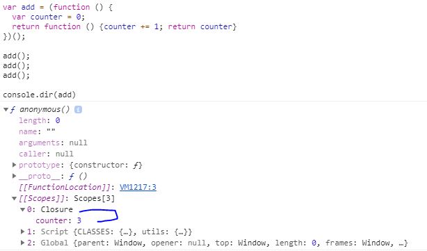

# Javascript Closure
A closure is the combination of a function bundled together (enclosed) with references to its surrounding state (the lexical environment). In other words, a closure gives you access to an outer function’s scope from an inner function. In JavaScript, closures are created every time a function is created, at function creation time.

- JavaScript variables can belong to the local or global scope.
- Global variables can be made local (private) with closures.

### Example 1 (Basic example)
```javascript
var add = (function () {
  var counter = 0;
  return function () {counter += 1; return counter}
})();

add();
add();
add();

console.dir(add)
// the counter is now 3
```

#### How to check closures?


### Closure Scope Chain
For every closure we have three scopes:
- Local Scope (Own scope)
- Outer Functions Scope
- Global Scope

### Example 2 
```javascript
// global scope
var e = 10;
function sum(a){
  return function(b){
    return function(c){
      // outer functions scope
      return function(d){
        // local scope
        return a + b + c + d + e;
      }
    }
  }
}

console.log(sum(1)(2)(3)(4)); // log 20


var e = 10;
function sum(a){
  return function sum2(b){
    return function sum3(c){
      // outer functions scope
      return function sum4(d){
        // local scope
        return a + b + c + d + e;
      }
    }
  }
}

var s = sum(1);
var s1 = s(2);
var s2 = s1(3);
var s3 = s2(4);
console.log(s3) //log 20
```
